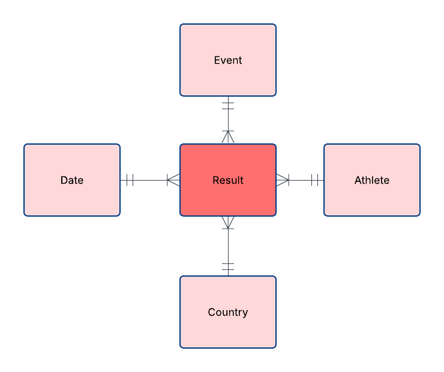

# Marathos Atlas
- Marathos Atlas is a Databricks project that analyzes marathon data.
- It uses a Bronze, Silver, and Gold pipeline to move raw race and country data from Unity Catalog into clean, useful tables.
- It prepares the data for analysis and shows the final insights in Databricks Dashboards and Genie.

[](https://www.youtube.com/watch?v=CZaByIBvFXo)

## Marathos Atlas Dashboard

Explore the interactive Databricks dashboard for marathon trends, country participation, athlete demographics, and race performance insights.

[](https://dbc-2dec513f-8560.cloud.databricks.com/dashboardsv3/01f15d7feca615899f2873e8eced399a/published?o=2997810357175606)

- Which countries have the most race result records?
- How has race participation changed over time?
- How do athlete demographics differ by gender and age group?
- How do kilometer, mile, and fixed-time race categories compare?
- Ask ad hoc questions through Genie.

## Tech Stack


## Project Flow


## Dataset

The main source is a marathon and ultramarathon race result dataset where each row represents one athlete result in one race. Key fields include:
```
- event name
- event date
- event distance
- number of finishers
- athlete ID
- athlete country
- gender
- age category
- performance
- average speed
```

## Code Structure

```text
.
├── transformations/
│   ├── bronze/
│   │   └── 01_bronze_ingestion.py
│   ├── silver/
│   │   └── 01_silver_marathon_obt.py
│   └── gold/
│       ├── 01_dim_event.py
│       ├── 02_dim_athlete.py
│       ├── 03_dim_country.py
│       ├── 04_dim_date.py
│       ├── 05_fact_results.py
│       └── 06_gold_views.py
├── utils/
│   ├── column_helpers.py
│   ├── pipeline_config.py
│   ├── silver_constants.py
│   └── table_names.py
├── explorations/
│   ├── raw/
│   ├── bronze/
│   ├── silver/
│   └── gold/
└── dimensional_modelling/
    ├── 10_dimensional_modelling.ipynb
    └── assets/
```

## Models
#### Conceptual Model


#### Logical Model


#### Physical Model


## DRY Principles (utils)
| Utility               | Purpose                                                                               |
| --------------------- | ------------------------------------------------------------------------------------- |
| `table_names.py`      | Centralizes catalog, schema, table, view, and volume paths.                           |
| `pipeline_config.py`  | Stores reusable Delta table properties.                                               |
| `column_helpers.py`   | Provides reusable column transformation helpers.                                      |
| `silver_constants.py` | Stores standard values, mappings, and reference constants for Silver transformations. |


## Validation


## Gold Layer Analytical Views

| View                         | Purpose                                                                              |
| ---------------------------- | ------------------------------------------------------------------------------------ |
| `vw_global_leaderboard`      | Country-level leaderboard for race records, unique athletes, events, speed, and age. |
| `vw_seasonal_race_trends`    | Monthly race activity, participation, event volume, and performance trends.          |
| `vw_country_seasonal_trends` | Country-level seasonal trends for dashboard filtering and comparison.                |
| `vw_runner_demographics`     | Runner participation and performance by gender and age group.                        |
| `vw_distance_km_results`     | Analytical view for kilometer-based race results.                                    |
| `vw_distance_mi_results`     | Analytical view for mile-based race results.                                         |
| `vw_time_hour_results`       | Analytical view for fixed-time race results.                                         |


## AI Use Disclaimer
## AI Assistance Disclaimer

This project was created by me as part of my data engineering coursework. I used an AI language model as a support tool while working on the project.

AI was used to help with:

* explaining data engineering concepts
* debugging errors
* improving documentation and naming
* generating longer SQL code for notebooks
* supporting scripts for the layers
* suggesting improvements for the Bronze, Silver, and Gold layers
* Creating the SQL Datasets in Databricks

All code, data cleaning, modelling decisions, validation checks, and final project choices were reviewed, tested, and adapted by me. I am responsible for the final solution.

AI was used as a learning and development support tool, not as a replacement for my own work or understanding.

